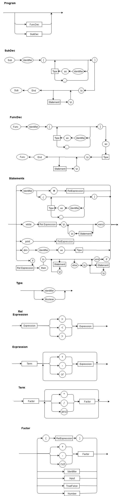

# toy_compiler

## How To Use

```
$ python main.py [input file]
```
test.vbs available for testing in the repository

## EBNF

```
comandos = “Begin”, “\n”, comando, “\n”, { comando, “\n” }, “End” ;
comando = atribuição | print | while | if ;
if = rel, then, comandos, (else, comandos, endif | endif);
while = rel, comandos, wend;
atribuição = identificador, “=”, expressão ;
rel = expressão, (“=” | “<” | “>”), expressão
expressão = termo, { (“+” | “-” | “or”), termo } ;
termo = fator, { (“*” | “/” | “and”), fator } ;
fator = (“+” | “-” | “not”), fator | número | “(”, expressão, “)” | identificador | Input ;
identificador = letra, { letra | digito | “_” } ;
número = dígito, { dígito } ;
letra = ( a | ... | z | A | ... | Z ) ;
dígito = ( 1 | 2 | 3 | 4 | 5 | 6 | 7 | 8 | 9 | 0 ) ;
```

## Diagram


