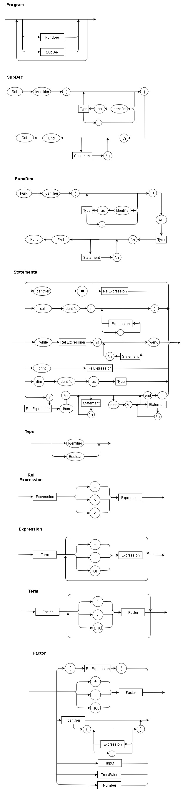

# toy_compiler

## How To Use

```
$ python main.py [input file]
```
test.vbs and test2.vbs available for testing in the repository

## EBNF

```
program = {( FuncDec | SubDec )} ; 
SubDec = "sub", identifier, "(", (identifier, "as", type, {",", identifier, "as", type} ), ")", "\n", {stmt, "\n"}, "end, "sub" ;
FuncDec = "function", identifier, "(", (identifier, "as", type, {",", identifier, "as", type} ), ")", "as", type, "\n", { stmt, "\n" }, "end, "function" ;
stmt = ( assignment | subcall | while | print | declaration | if ) ; 
assignment = identifier, "=", relExpression ;
funccall = identifier, "(", (identifier, "as", type, {",", identifier, "as", type} ), ")" ;
subcall = "call", identifier, "(", (expression, {",",expression}), ")" ;
while = "while", relExpression, "\n", { stmt, "\n"}, "wend" ;
print = "print", relExpression ;
declaration = "dim", identifier, "as", type ;
if = "if", relExpression, "then", "\n", {stmt, "\n"}, ("else", "\n", {stmt, "\n"}), "end", "if" ;
type = integer | boolean
relExpression = expression, ("=" | "<" | ">"), expression ;
expression = term, { (“+” | “-” | “or”), term } ;
term = factor, { (“*” | “/” | “and”), factor } ;
fator = ((“+” | “-” | “not”), factor) | identifier | funccall | "input" | boolean | integer | ( "(", relExpression, ")" ) ;
identifier = letter, {letter | digit | "_"} ;
integer = digit, { digit } ;
boolean = True | False
letter = ( a | ... | z | A | ... | Z ) ;
dígit = ( 1 | 2 | 3 | 4 | 5 | 6 | 7 | 8 | 9 | 0 ) ;
```

## Diagram


